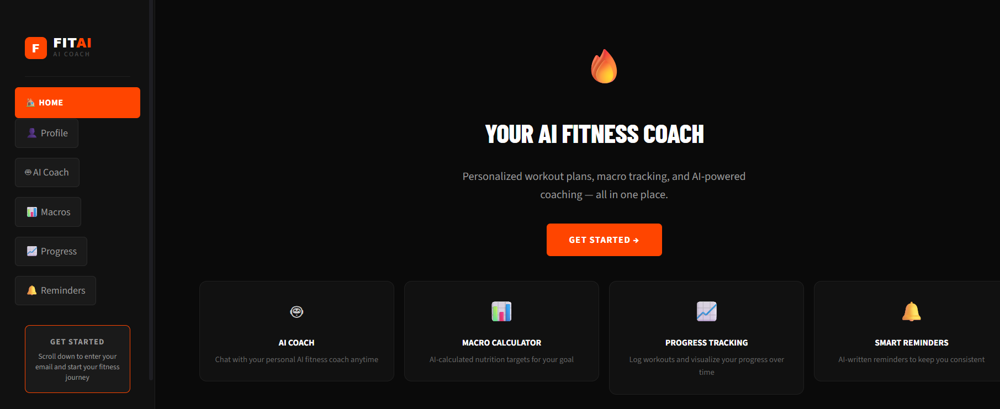
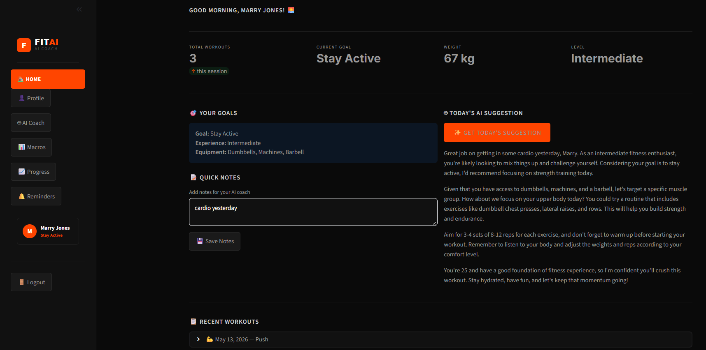
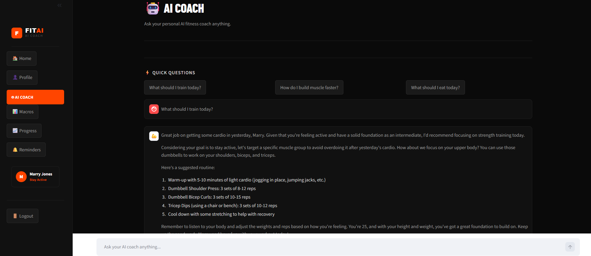
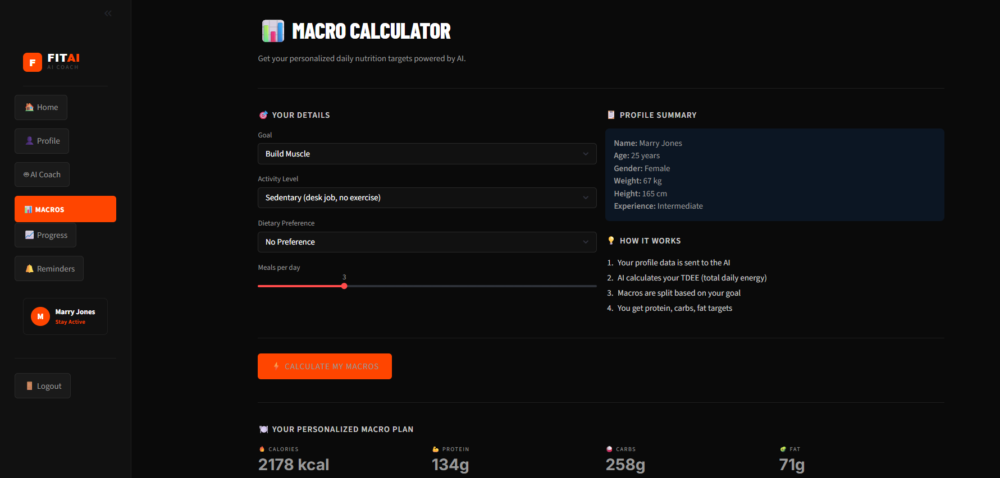
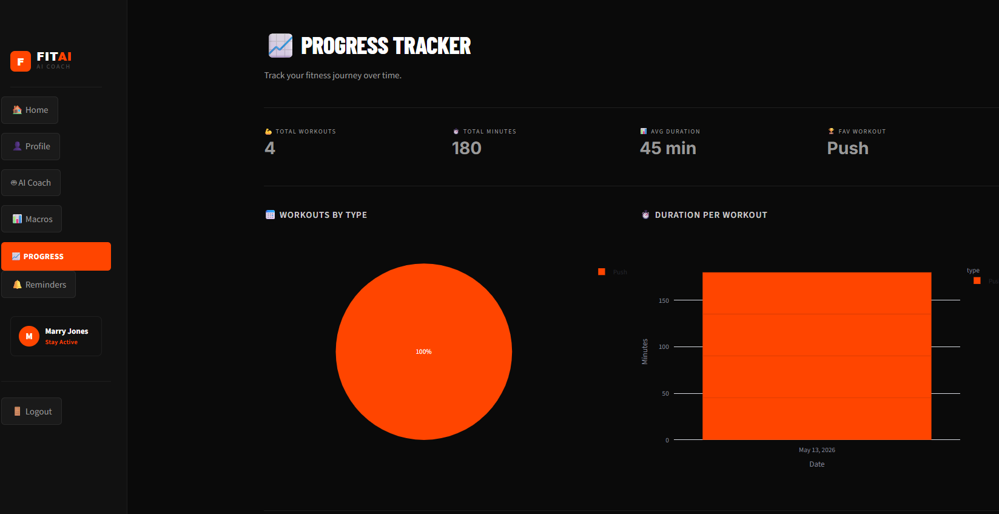

# 🔥 FitAI — Multi-Agent AI Fitness Coach

A full-stack AI-powered fitness application built with Python, Groq LLM, AstraDB, and Streamlit. Features a multi-agent architecture that routes user queries to specialized AI agents for personalized fitness coaching.

## 🚀 Live Demo

**[→ Try FitAI Live](https://fit-ai1.streamlit.app/)**

---

## 📸 Screenshots

### Landing Page


### Home Dashboard


### AI Coach


### Macro Calculator


### Progress Tracker


---

## 🧠 What Makes This Different

Most fitness apps are static. FitAI uses a **multi-agent AI architecture** where different specialized LLMs handle different tasks:

- **Router Agent** — classifies user intent and delegates to the right specialist
- **Workout Agent** — generates personalized training plans based on history
- **Nutrition Agent** — calculates macros and meal recommendations
- **Progress Agent** — reads past workouts to avoid repetition and ensure progression

The multi-agent system was designed and prototyped in **Langflow** and deployed using direct **Groq API** integration for production reliability and zero hosting cost.

---

## ✨ Features

- 🤖 **AI Coach** — Chat with a personalized AI coach that knows your history
- 📊 **Macro Calculator** — AI-calculated daily protein, carbs, fat, and calorie targets
- 📈 **Progress Tracker** — Log workouts and visualize trends with Plotly charts
- 🔔 **Smart Reminders** — AI-written personalized reminder emails via Gmail SMTP
- 💾 **Persistent Data** — All user data stored in AstraDB vector database
- 🔐 **Email-based Auth** — Simple login, no passwords needed
- ⚡ **Parallel DB Loading** — All user data loads simultaneously using ThreadPoolExecutor

---

## 🏗️ Architecture

```
User Input
    ↓
Streamlit Frontend (6 pages)
    ↓
Python Backend (main.py)
    ↓
Multi-Agent Routing Logic
    ├── Router — classifies intent (math vs advice)
    ├── Workout/Advice Agent — personalized coaching
    └── Macro Agent — nutrition calculation
    ↓
Groq LLM (llama-3.3-70b-versatile)
    ↓
AstraDB (user profiles, workouts, notes, reminders)
```

---

## 🛠️ Tech Stack

| Layer | Technology |
|-------|-----------|
| Frontend | Streamlit, Plotly, Custom CSS |
| Backend | Python |
| AI Design | Langflow (prototyping + architecture) |
| AI/LLM | Groq API (llama-3.3-70b-versatile) |
| Database | AstraDB (Serverless Vector DB) |
| Email | Gmail SMTP |
| Deployment | Streamlit Cloud |

---

## 📁 Project Structure

```
FitAI/
├── app.py                 # Main app — config, navigation, login
├── main.py                # Groq API calls — ask_ai, get_macro
├── database.py            # AstraDB functions with parallel loading
├── requirements.txt
├── .env                   # secrets (not committed)
└── components/
    ├── __init__.py
    ├── home.py            # Dashboard page
    ├── profile.py         # User profile setup
    ├── coach.py           # AI chat + workout logging
    ├── macros.py          # Macro calculator
    ├── progress.py        # Charts and history
    └── reminders.py       # Email reminder settings
```

---

## ⚙️ Setup & Installation

### Prerequisites
- Python 3.10+
- AstraDB account (free)
- Groq API key (free)
- Gmail account with App Password

### 1. Clone the repo
```bash
git clone https://github.com/navneetk11/Fit-AI.git
cd Fit-AI
```

### 2. Install dependencies
```bash
pip install -r requirements.txt
```

### 3. Set up environment variables
Create a `.env` file:
```
GROQ_API_KEY=your-groq-api-key
ASTRA_DB_TOKEN=AstraCS:your-token
ASTRA_DB_ENDPOINT=https://your-db.apps.astra.datastax.com
EMAIL=your-gmail@gmail.com
APP_PASSWORD=your-16-char-app-password
```

### 4. Run the app
```bash
python -m streamlit run app.py
```

---

## 📊 Key Technical Decisions

**Why multi-agent instead of single LLM?**
Different tasks need different system prompts and context. A workout planner needs exercise science knowledge; a nutrition agent needs dietary expertise. Routing to specialists improves accuracy and response quality.

**Why AstraDB over PostgreSQL?**
AstraDB supports vector embeddings natively — useful for future RAG features. Also serverless with a generous free tier, no infrastructure setup required.

**Why Groq over OpenAI?**
Groq's free tier has much higher rate limits (14,400 requests/day vs OpenAI's 20/day on free tier). llama-3.3-70b performs comparably to GPT-4o-mini for fitness coaching tasks.

**Why Streamlit over React?**
Faster to build data-heavy UIs. The focus is on the AI architecture, not the frontend framework. Easily upgradeable to React + FastAPI.

**Why parallel DB loading?**
Sequential AstraDB calls (4 calls × ~1s each = 4s load time) were too slow for a good user experience. Using Python's ThreadPoolExecutor to run all 4 calls simultaneously reduced login time to ~1 second.

---

## 🔮 Future Improvements

- [ ] RAG pipeline — embed exercise science PDFs for more accurate advice
- [ ] APScheduler — automatic daily reminder emails
- [ ] React frontend — replace Streamlit with proper SPA
- [ ] Docker containerization
- [ ] GitHub Actions CI/CD pipeline
- [ ] OpenAI embeddings for semantic workout search

---

## 📝 Resume Bullets

- Designed a **multi-agent AI system** using Langflow that routes user intent to specialized LLMs — workout planner, nutrition advisor, and progress analyst agents
- Built **persistent user profiles** and time-series workout history in AstraDB; agents query past sessions to generate progressive, personalized training plans
- Implemented **parallel database loading** using Python ThreadPoolExecutor, reducing login time by 75% compared to sequential calls
- Developed a **6-page Streamlit application** with email-based authentication, Plotly progress dashboards, and AI-generated personalized reminder emails via Gmail SMTP
- Integrated **Groq LLM API** (llama-3.3-70b) for real-time AI coaching with sub-2 second response times
- Deployed on **Streamlit Cloud** with AstraDB for persistent multi-user data storage

---

## 👩‍💻 Author

**Navneet Kaur**
[GitHub](https://github.com/navneetk11) · [LinkedIn](https://linkedin.com/in/nkaurbajwa)

---

## 📄 License

MIT License — feel free to use this project as a reference or starting point.
